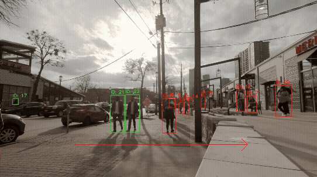

# MoshouSapient: AI 智慧影像分析平台

  

MoshouSapient 是一個基於 Python 與 NVIDIA TensorRT 技術棧所建構的高效能智慧影像分析平台。本專案旨在實踐即時影像處理、多物件追蹤 (MOT) 與人物重識別 (Re-ID) 等技術的整合應用。系統能夠處理 RTSP 影像流或本地影片檔案，執行即時物件偵測與分析，並在觸發特定事件時，將結構化的分析結果與特徵資料進行持久化儲存，為後續的進階查詢與分析奠定基礎。



## 專案狀態

:construction: **本專案為學習與實踐導向，仍在持續開發中。**

目前已完成核心功能的 PoC (概念驗證)，並具備穩定的基礎架構與初步的行為分析能力。系統架構已為未來的功能擴展 (如多攝影機協同管理) 預留了清晰的介面。歡迎任何形式的建議與討論。

## 核心特性

-   **高效能推論管線 (High-Performance Inference Pipeline)**: 整合 **YOLO** 物件偵測模型與 **NVIDIA TensorRT** 引擎，並利用 **NVENC** 硬體編碼器加速事件錄影，以實現低延遲的即時處理能力。
-   **穩定的物件追蹤 (Robust Object Tracking)**: 採用 **BOTSORT** 演算法，並將偵測與特徵提取流程解耦。**透過在事件邊界重新實例化追蹤器，有效解決了在連續事件處理中因狀態殘留導致的追蹤性能衰退問題，確保了長時間運行的穩定性。**
-   **人物重識別 (Person Re-Identification)**:
    -   **動態特徵庫 (Dynamic Feature Gallery)**: 為偵測到的每個獨立個體建立其特徵向量集合，形成一個動態更新的人物特徵庫。
    -   **關聯比對邏輯**: 透過事件內的特徵聚類與跨事件的資料庫比對，嘗試關聯複雜場景中的多個目標，以應對姿態、光照變化與短暫遮蔽所帶來的挑戰。
-   **Re-ID 模型的整合性考量 (Re-ID Model Integration Considerations)**: 專案初期目標是實現 Re-ID 模型的可替換性。然而，經過深入調研發現，當前高效能的第三方 Re-ID 模型均與其專屬的程式碼框架深度綁定。要將其整合進本專案，需要對不同的資料預處理、模型結構及特徵後處理流程進行深度分析與客製化開發。考量到本專案「保持架構簡潔穩定」的核心原則，以及開發資源的限制，現階段決定**維持在 Ultralytics 生態系內**，使用其提供的基線模型。這是一個在性能與維護複雜度之間取得平衡的務實決策。
-   **高階行為分析 (Advanced Behavioral Analysis)**:
    -   **區域入侵與停留偵測 (ROI Dwell Time)**: 支援使用者自訂多邊形感興趣區域 (ROI)，能夠偵測目標是否進入特定區域，並在停留時間超過預設閾值時，觸發獨立的 `'dwell_alert'` 事件。
    -   **方向性虛擬警戒線 (Directional Tripwire)**: 支援使用者定義帶有方向的虛擬線段。系統利用向量叉積判斷目標的移動軌跡，僅在符合預設方向的跨越發生時，觸發 `'tripwire_alert'` 事件，以過濾無關行為。
    -   **事件優先級系統 (Event Priority System)**: 內建 `tripwire_alert` > `dwell_alert` > `person_detected` 的事件優先級機制。當更高優先級的行為發生時，可將正在錄製中的低優先級事件「升級」，確保最終儲存的事件類型能反映最關鍵的行為。
    -   **事件分段機制 (Event Segmentation)**: 透過事件狀態管理，系統能夠在持續活動的場景中，因達到最大錄影時長而自動切分事件，確保長時間活動能被記錄為多個獨立的事件片段。
-   **事件驅動的持久化 (Event-Driven Persistence)**: 系統能在偵測到人物或特定行為時觸發事件，並使用 SQLAlchemy ORM 將 Re-ID 特徵向量與事件元數據，以結構化的方式存入 SQLite 資料庫 (WAL 模式)。
-   **靈活的影片輸出設定 (Flexible Video Output Configuration)**:
    -   **幀率控制**: 使用者可選擇保留來源影片的處理後實際幀率 (`SOURCE` 模式)，或將輸出影片降採樣至指定的目標幀率 (`TARGET` 模式)，以在保真度與檔案大小間取得平衡。
    -   **編碼策略**: 提供兩種編碼模式供選擇。「品質」(`QUALITY`) 模式優先保證恆定的視覺品質，而「均衡」(`BALANCED`) 模式則將影片控制在指定的平均位元率，以實現可預測的檔案大小，更適合長時間監控的儲存需求。
-   **分層與模組化架構 (Layered & Modular Architecture)**: 採用標準化的 `src` 專案佈局，並將應用程式邏輯清晰地劃分為 `core`, `streams`, `processors`, `services` 等多個職責明確的子套件，實現了高度的內聚與解耦，為未來的擴展提供了良好的基礎。
-   **遠端存取與可選通知 (Remote Access & Optional Notifications)**:
    -   內建基於 **Flask** 的輕量級 Web 儀表板，用於遠端查看事件紀錄與回放。
    -   可選整合 **Discord Bot**，以非同步方式推送即時警報。

## 技術棧

-   **核心框架**: Python 3.11
-   **AI / CV**: PyTorch, TensorRT, Ultralytics YOLO, BOTSORT, Shapely (幾何分析)
-   **資料庫**: SQLite, SQLAlchemy (ORM)
-   **Web 後端**: Flask
-   **影像處理**: FFmpeg, OpenCV-Python
-   **設定管理**: Pydantic-Settings, PyYAML
-   **其他**: python-dotenv

## 系統檔案結構
```
MoshouSapient/                          # 專案根目錄
│
├── .env.example                        # 環境變數設定檔範本
├── .gitignore                          # Git 版本控制忽略清單
├── README.md                           # 專案說明文件
├── requirements.txt                    # Python 依賴套件列表
│
├── configs/                            # 存放所有靜態設定檔
│   ├── behavior_analysis.yaml          # 行為分析規則 (ROI, 警戒線)
│   └── custom_botsort.yaml             # BoT-SORT 追蹤器客製化參數
│
├── data/                               # 存放專案資料
│   └── video_samples/                  # 存放 FILE 模式的範例影片
│
├── docs/                               # 存放所有文件與相關資源
│   └── assets/                         # 存放 README 中使用的圖片
│
├── models/                             # 存放所有 AI 模型資產
│   ├── yolo11s.pt                      # (需下載) PyTorch 格式的偵測模型
│   ├── yolo11s-cls.pt                  # (需下載) PyTorch 格式的 Re-ID 模型
│   └── yolo11s.engine                  # (動態生成) TensorRT 格式的偵測模型
│
├── scripts/                            # 存放輔助開發腳本
│   └── export_tensorrt.py              # 模型轉換為 TensorRT 引擎的腳本
│
└── src/                                # 存放所有專案原始碼
    └── moshousapient/                  # 專案主 Python 套件
        ├── __init__.py                 # 將目錄標記為 Python 套件
        ├── __main__.py                 # 套件執行入口 (python -m moshousapient)
        │
        ├── core/                       # 核心業務邏輯與協調器
        │   ├── __init__.py
        │   ├── camera_worker.py        # 管理單一攝影機管線的協調器
        │   ├── main.py                 # 應用程式主邏輯
        │   └── runners.py              # 執行策略模組 (RTSP/File 模式)
        │
        ├── processors/                 # 持續性資料流處理單元
        │   ├── __init__.py
        │   ├── base_processor.py       # 處理器抽象基礎類別
        │   ├── event_processor.py      # 事件偵測與狀態管理處理器
        │   └── inference_processor.py  # AI 推論處理器
        │
        ├── services/                   # 事件驅動型服務
        │   ├── __init__.py
        │   ├── discord_notifier.py     # Discord Bot 通知服務
        │   └── video_recorder.py       # 影片錄製與資料庫儲存服務
        │
        ├── streams/                    # 資料來源讀取模組
        │   ├── __init__.py
        │   └── video_streamer.py       # FFmpeg 影像流讀取模組
        │
        ├── utils/                      # 通用工具函式子套件
        │   ├── __init__.py
        │   ├── geometry_utils.py       # 通用幾何計算工具
        │   ├── reid_utils.py           # Re-ID 相關工具函式
        │   └── video_utils.py          # 影片元數據讀取工具
        │
        ├── web/                        # Web 儀表板子套件
        │   ├── __init__.py
        │   ├── app.py                  # Flask 應用程式與路由定義
        │   └── templates/              # Web 儀表板的 HTML 樣板
        │       └── index.html          # 儀表板主頁面樣板
        │
        ├── config.py                   # 應用程式初始化協調器
        ├── database.py                 # 資料庫設定與 Session 管理
        ├── logging_setup.py            # 全域日誌設定模組
        ├── models.py                   # 資料庫 ORM 模型定義
        └── settings.py                 # Pydantic 靜態設定管理
```

## 環境準備

### 硬體與軟體需求
-   **作業系統**: Windows 10 / 11
-   **GPU**: 支援 NVENC 硬體編碼的 NVIDIA 顯示卡 (建議 GeForce RTX 系列)
-   **攝影機**: 支援 RTSP 協定的網路攝影機
-   **Python**: 3.11

### 安裝步驟

1.  **安裝 NVIDIA 工具鏈**:
    -   NVIDIA 驅動程式
    -   CUDA Toolkit (建議版本 12.x 或更高)
    -   cuDNN (需對應 CUDA 版本)
    -   TensorRT (需對應 CUDA 版本)

2.  **安裝核心工具**:
    -   Python 3.11 (安裝時建議勾選 "Add Python to PATH")
    -   FFmpeg (需將其 `bin` 目錄加入系統環境變數 PATH)

3.  **設定 Python 虛擬環境**:
    ```bash
    # 建立虛擬環境
    python -m venv venv
    # 啟用虛擬環境
    .\venv\Scripts\activate
    ```

4.  **安裝 Python 依賴**:
    ```bash
    # 1. 根據您的 CUDA 版本，從 PyTorch 官網安裝對應的 GPU 版本
    # 例如 CUDA 12.x:
    pip install torch torchvision torchaudio --index-url https://download.pytorch.org/whl/cu12x

    # 2. 安裝其餘依賴
    pip install -r requirements.txt
    ```

5.  **準備 AI 模型**:
    -   將 `yolo11s.pt` (物件偵測) 和 `yolo11s-cls.pt` (Re-ID) 模型檔案放置在 `models/` 資料夾中。
    -   執行轉換腳本，將`yolo11s.pt`生成為 TensorRT 引擎：
        ```bash
        python scripts/export_tensorrt.py
        ```
    -   成功後會在 `models/` 資料夾下生成 `yolo11s.engine` 檔案。

## 專案設定與執行

1.  **設定環境變數**:
    在專案根目錄下，將 `.env.example` 複製一份並重新命名為 `.env`。此檔案用於集中管理所有環境特定的或敏感的設定。如果您想使用系統預設值，可以將 `.env` 中的對應行註解掉。

    ```env
    # .env 範例

    # --- 影像來源設定 (必要) ---
    VIDEO_SOURCE_TYPE="FILE"
    VIDEO_FILE_PATH="data/video_samples/input.mp4"
    # 【RTSP 模式專用】RTSP 的傳輸協定。可選值: "UDP", "TCP"
    RTSP_TRANSPORT_PROTOCOL="UDP"
    RTSP_URL=""

    # --- 事件影片幀率設定 (可選, 預設為 TARGET, 30.0 FPS) ---
    VIDEO_FPS_MODE="TARGET"
    TARGET_FPS=30.0

    # --- 事件影片編碼設定 (可選, 預設為 BALANCED, 2.0 Mbps) ---
    VIDEO_ENCODING_MODE="BALANCED"
    TARGET_BITRATE_MBPS=2.0
    ```

2.  **設定行為分析規則 (重要)**:
    打開 `configs/behavior_analysis.yaml` 檔案，根據您的場景需求，設定感興趣區域 (ROI) 和虛擬警戒線 (Tripwire) 的座標與規則。檔案內有詳細的註解說明。

3.  **(可選) 微調追蹤器**:
    若在特定場景下追蹤效果不佳（如目標頻繁被遮擋），可編輯 `configs/custom_botsort.yaml` 來微調追蹤演算法的參數。檔案內有各參數的詳細說明。

4.  **啟動系統**:
    在專案**根目錄**下，執行以下指令：
    ```bash
    python -m moshousapient
    ```

5.  **驗證**:
    -   打開瀏覽器，訪問 Web 儀表板： `http://127.0.0.1:5000`
    -   觸發事件（例如，讓人物出現在攝影機畫面中，或使用包含人物的影片檔案）。
    -   如果啟用了 Discord，檢查是否收到通知。
    -   檢查 Web 儀表板是否出現新的事件紀錄。

## 發展藍圖

基於當前的架構與技術現狀，專案的後續發展將分為近期重點與長期方向。

### 近期開發重點
-   **核心功能修正**: 優先分析並解決當前系統中，影片事件分段與偵測邏輯存在的穩定性問題，以鞏固後續功能開發的基礎。
-   **白名單 (Whitelist) 過濾功能**: 建立一個可預先註冊的「熟人」特徵庫。當系統偵測到的人員與白名單匹配時，可選擇抑制警報或以特定標籤記錄，以減少對授權人員的無效告警。
-   **行為分析擴展**: 在穩定的基礎上，繼續開發如「人員徘徊」等新的行為分析模組。
-   **前端介面強化**: 逐步擴充 Web 儀表板功能，例如增加事件篩選、排序，或提供 ROI/警戒線的視覺化設定介面。

### 長期研究方向
-   **進階資料庫查詢**: 探索基於 Re-ID 特徵向量的相似度搜尋，以實現特定人物的歷史事件檢索。此功能**高度依賴** Re-ID 模型的準確性。
-   **多攝影機協同**: 將現有的單攝影機架構擴展為多攝影機管理，並利用特徵庫實現跨攝影機的目標重識別。此功能對 Re-ID 性能與系統架構的要求**極高**，是專案的終極探索目標。

## 開發模式說明

本專案的開發過程，是一次探索人類開發者與大型語言模型 (LLM, 如 Google Gemini Pro) 協同作業的實踐。

在此模式中，人類開發者的角色聚焦於：
-   **定義高階目標與架構設計**: 提出專案的整體目標、功能規格與模組劃分。
-   **提供精確的技術上下文**: 蒐集並提供關鍵技術的官方文件或 API 規格，作為 LLM 生成程式碼的依據。
-   **進行迭代式驗證與除錯**: 在真實環境中測試程式碼，並將錯誤訊息、堆疊追蹤和非預期行為，以結構化的方式反饋給 LLM，引導其進行修正與優化。

這個流程旨在將人類的策略性思考、領域知識與 LLM 的高效程式碼生成能力相結合，探索一種現代化的軟體開發工作流程。

## License

本專案採用 [AGPL-3.0 License](https://www.gnu.org/licenses/agpl-3.0.html) 授權。